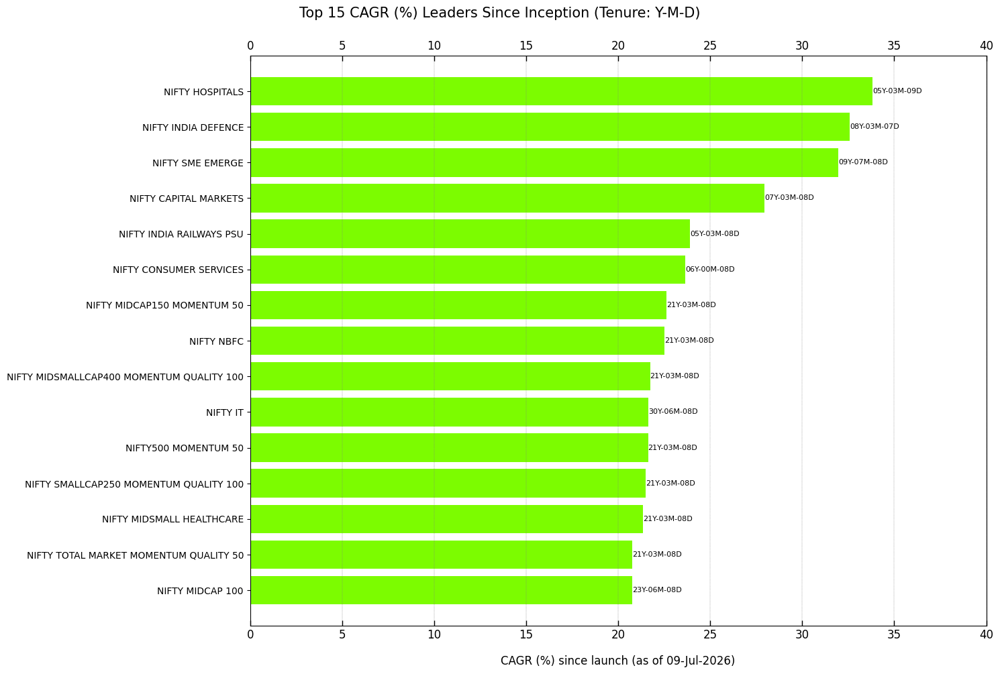
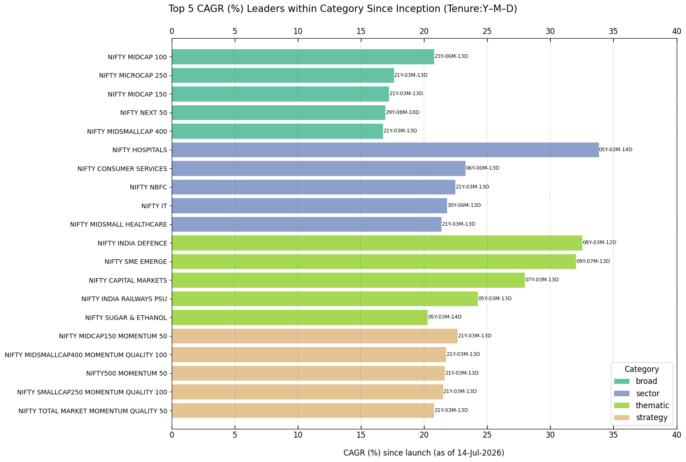
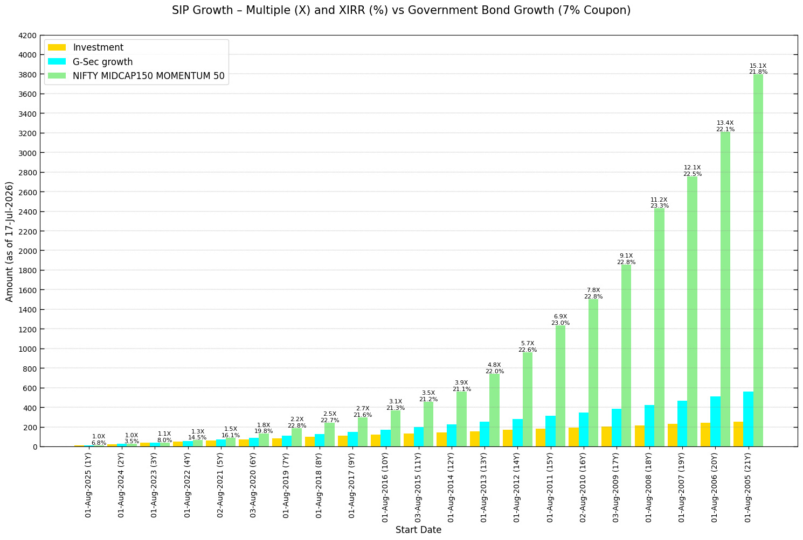
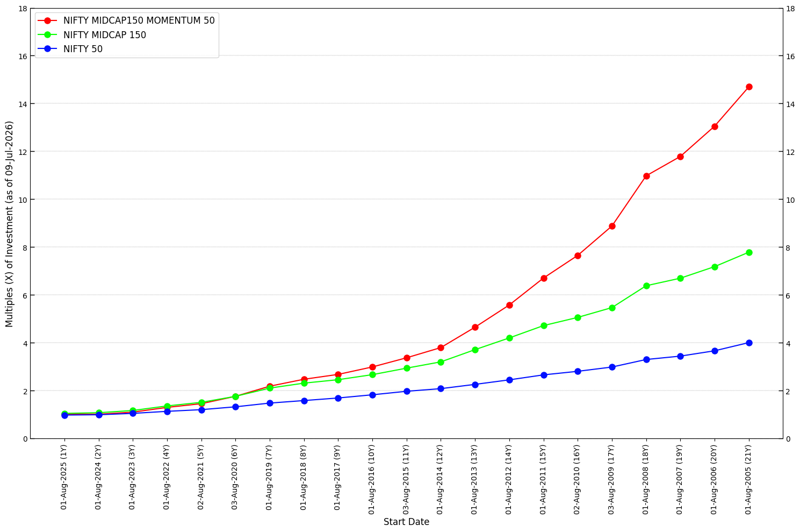

============
User Guide
============

This guide provides a quick overview to get started with :mod:`BharatFinTrack`.

Verify Installation
---------------------
Ensure a successful installation by running the following commands.

.. code-block:: python

    import BharatFinTrack

     
Equity Index Base Parameters
--------------------------------
Save the MultiIndex DataFrame containing the base parameters of equity indices to an Excel file.

.. code-block:: python

    nse_product = BharatFinTrack.NSEProduct()
    
    nse_product.equity_base_parameter_midf(
        excel_file=r'C:\Users\Username\Folder\base_parameter.xlsx'
    )

Download Data
----------------
A brief overview of features related to data downloading. Start by instantiating the classes.

.. code-block:: python

    nse_pri = BharatFinTrack.NSEIndex()
    nse_tri = BharatFinTrack.NSETRI()

PRI Summary
^^^^^^^^^^^^^^^^^
Download the daily summary report of ``PRI`` closing values, published daily
on the `Nifty Indices Reports <https://www.niftyindices.com/reports/daily-reports/>`_, and save
it as a CSV file.

.. code-block:: python

    nse_pri.download_equity_close(
        csv_file=r"C:\Users\Username\Folder\PRI_closing.csv"
    )

.. _f_download_daily_tri:

Historical TRI Daily Data
^^^^^^^^^^^^^^^^^^^^^^^^^^^^
Download historical daily ``TRI`` data for the ``NIFTY 50`` index. Currently, the function supports only equity indices.

.. code-block:: python
    
    # Downloading daily closing TRI data up to a specified date
    nse_tri.download_daily_data(
        index='NIFTY 50',
        start_date=None,
        end_date='31-Mar-2024',
        csv_file=r"C:\Users\Username\Folder\NIFTY 50.csv",
    )
    
    # Using the same CSV file to update daily closing TRI data to the present date
    nse_tri.update_daily_data(
        index='NIFTY 50',
        csv_file=r"C:\Users\Username\Folder\NIFTY 50.csv"
    )

TRI Closing Values
^^^^^^^^^^^^^^^^^^^^^^^^^^^^
Download the closing ``TRI`` values for all equity indices. These values are not updated daily on the website. 
It is recommended to run this function at night when web traffic is lower, as it sends multiple requests to retrieve the required data.

.. code-block:: python
    
    nse_tri.download_equity_close(
        csv_file=r"C:\Users\Username\Folder\TRI_closing.csv"
    )

CAGR and SIP
-----------------
A brief overview of features related to Compound Annual Growth Rate (CAGR) and Systematic Investment Plan (SIP). Start by instantiating the classes.

.. code-block:: python

    cagr = BharatFinTrack.CAGR()
    sip = BharatFinTrack.SIP()

CAGR Summary Since Inception
^^^^^^^^^^^^^^^^^^^^^^^^^^^^^^^^^^^
The following methods can be used to compute CAGR (%) of all equity indices since inception. The resulting CAGR (%) values are used to sort the equity indices in descending order, either overall or within each category.

.. code-block:: python
    
    # Sort equity indices by CAGR (%) since launch
    cagr.sort_since_inception(
        csv_file=r"C:\Users\Username\Folder\TRI_closing.csv",
        excel_file=r"C:\Users\Username\Folder\sort_cagr.xlsx"
    )
    
    # Sort equity indices by CAGR (%) since launch within each category 
    cagr.sort_since_inception(
        csv_file=r"C:\Users\Username\Folder\TRI_closing.csv",
        within_category=True,
        excel_file=r"C:\Users\Username\Folder\sort_cagr_within_category.xlsx",
    )
    
    
Year-wise SIP Growth
^^^^^^^^^^^^^^^^^^^^^^^^^^^^^^^^^^^
Compute the year-wise SIP returns for a fixed monthly contribution to a specified equity ``TRI`` index.

.. code-block:: python
    
    sip.yearly_return(
        csv_file=r"C:\Users\Username\Folder\NIFTY 50.csv",
        invest=1000,
        excel_file=r"C:\Users\Username\Folder\NIFTY 50_SIP.xlsx",
    )

    
Year-wise SIP and CAGR Comparison
^^^^^^^^^^^^^^^^^^^^^^^^^^^^^^^^^^^
This section compares the year-wise XIRR (%) and growth multiples (X) of a fixed monthly SIP investment, along with the year-wise CAGR (%) and growth multiples of a one-time investment across selected ``TRI`` indices.

The required data are sourced from CSV files generated in the :ref:`Historical TRI Daily Data <f_download_daily_tri>` section. Ensure that all input CSV files are stored in the designated folder, with each file named as ``{index}.csv`` to match the index names provided in the list. The output highlights the highest growth cells in green-yellow and the lowest growth cells in sandy brown.

.. code-block:: python

    index_list = [
        'NIFTY 50',
        'NIFTY ALPHA 50',
        'NIFTY MIDCAP150 MOMENTUM 50',
        'NIFTY500 MOMENTUM 50'
    ]

    # SIP comparison
    sip.compare_performances(
        indices=index_list,
        dir_path=r"C:\Users\Username\Folder",
        excel_file=r"C:\Users\Username\Folder\compare_sip.xlsx"
    )

    # CAGR comparison
    cagr.compare_performance(
        indices=index_list,
        dir_path=r"C:\Users\Username\Folder",
        excel_file=r"C:\Users\Username\Folder\compare_cagr.xlsx"
    )
  

Correction and Recovery Cycles
---------------------------------
This functionality identifies key turning points in an index's historical values based on consecutive corrections and recoveries. It applies minimum gain and multiplier filters to analyze the frequency and behavior of these movements over time.

.. code-block:: python

    analyzer = BharatFinTrack.Analyzer()

    analyzer.correction_recovery_cycles(
        csv_file=r"C:\Users\Username\Folder\NIFTY 50.csv",
        excel_file=r"C:\Users\Username\Folder\NIFTY 50_correction_recovery.xlsx"
    )

Visualization
----------------
A brief overview of features related to data visualization. Start by instantiating the class.

.. code-block:: python

    visual = BharatFinTrack.Visual()

CAGR Leaders
^^^^^^^^^^^^^^^^^^

This section presents bar plots of equity index CAGR (%) in descending order, either overall or within each category.

The following code plots the top 15 equity indices by overall ``TRI`` CAGR (%).

.. code-block:: python
    
    visual.cagr_leaders(
        excel_file=r"C:\Users\Username\Folder\sort_cagr.xlsx",
        figure_file=r"C:\Users\Username\Folder\sort_cagr.png"
    )

The following code plots the top five equity indices by ``TRI`` CAGR (%) within each category since launch.

.. code-block:: python
    
    visual.cagr_leaders_by_category(
        excel_file=r"C:\Users\Username\Folder\sort_cagr_within_category.xlsx",
        figure_file=r"C:\Users\Username\Folder\sort_cagr_within_category.png"
    )

SIP Comparison with Government Securities
^^^^^^^^^^^^^^^^^^^^^^^^^^^^^^^^^^^^^^^^^^^^^^^^^
The following code displays a bar plot comparing SIP returns over time for the ``TRI`` data of an index and government securities with an assumed yield.

.. code-block:: python
    
    visual.compare_sip_to_bond_benchmark(
        excel_file=r"C:\Users\Username\Folder\NIFTY MIDCAP150 MOMENTUM 50_SIP.xlsx",
        figure_file=r"C:\Users\Username\Folder\sip_growth_vs_bond_benchmark.png"
    )

The resulting plot will resemble the example shown below.

   
   
SIP Comparison Across Indices
^^^^^^^^^^^^^^^^^^^^^^^^^^^^^^^^^^^^^^^^^^^^^^^^^

This section presents a plot comparing the year-wise growth multiples (X) of a monthly SIP investment across ``TRI`` indices.

.. code-block:: python
    
    visual.compare_performance(
        excel_file=r"C:\Users\Username\Folder\compare_sip.xlsx",
        figure_file=r"C:\Users\Username\Folder\compare_sip.png"
    )
    
The resulting plot will resemble the example shown below.

