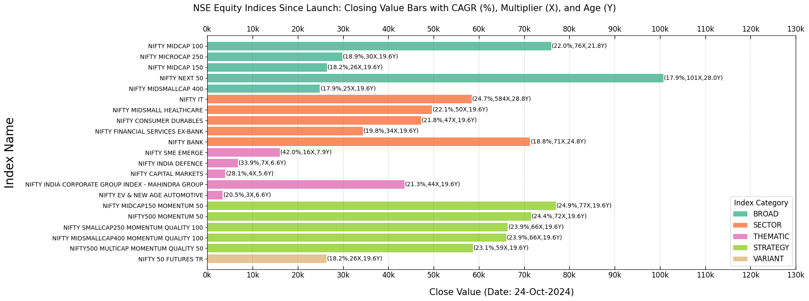
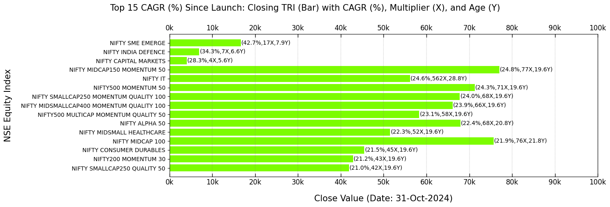
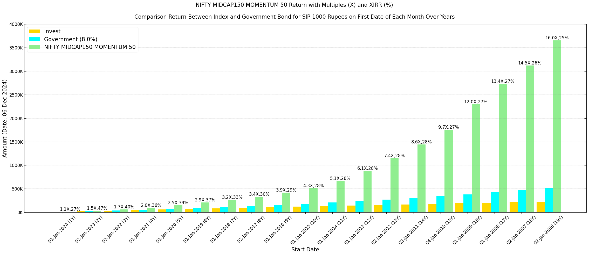
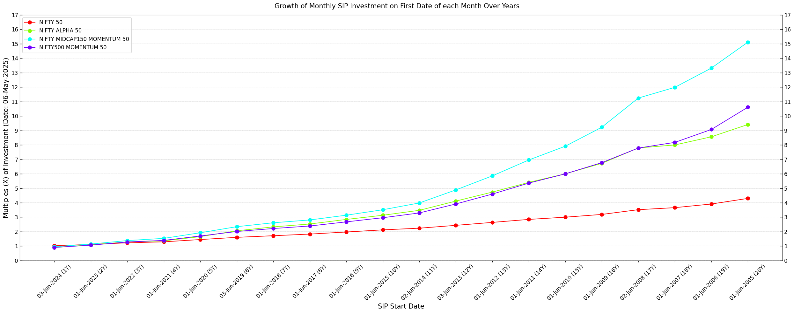

============
User Guide
============

This guide provides a quick overview to get started with :mod:`BharatFinTrack`.

Verify Installation
---------------------
Ensure successful installation by running the following commands.

.. code-block:: python

    import BharatFinTrack
    nse_product = BharatFinTrack.NSEProduct()
    
    
Index Category
----------------

Retrieve the equity index categories.

.. code-block:: python

    nse_product.equity_index_category
    
Expected output:

.. code-block:: text

    ['broad', 'sector', 'thematic', 'strategy', 'variant']

Index List
-------------------

Get the list of all equity indices.

.. code-block:: python
    
    nse_product.all_equity_indices
    
Expected output:

.. code-block:: text

    ['NIFTY 100',
     'NIFTY 200',
     'NIFTY 50',
     ...]

Categorical Index
-------------------

Fetch equity indices belonging to a specific category.

.. code-block:: python
    
    nse_product.get_equity_indices_by_category('strategy')
    
Expected output:

.. code-block:: text

    ['NIFTY ALPHA 50',
     'NIFTY ALPHA LOW-VOLATILITY 30',
     'NIFTY ALPHA QUALITY LOW-VOLATILITY 30',
     ...]
     
     
Index Base Parameters
-----------------------

Retrieve the base date and base value of an equity index:

.. code-block:: python
    
    nse_product.get_equity_index_base_date('NIFTY 50')
    nse_product.get_equity_index_base_value('NIFTY 50')
    
Expected output:

.. code-block:: text

    '03-Nov-1995'
    1000.0

Download Data
----------------
A brief overview of the features related to downloading data. Let's start by instantiating the classes.

.. code-block:: python

    import BharatFinTrack
    nse_index = BharatFinTrack.NSEIndex()
    nse_tri = BharatFinTrack.NSETRI()

Price Index Daily Summary
---------------------------

Download the daily summary report for index values, which is uploaded daily
on the `Nifty Indices Reports <https://www.niftyindices.com/reports/daily-reports/>`_, and save
in the specified folder path.

.. code-block:: python

    nse_index.download_daily_summary_report(
        folder_path=r"C:\Users\Username\Folder"
    )

.. _f_download_tri:

Historical TRI Data
----------------------

Download historical daily ``TRI`` data, including both price and dividend reinvestment, for the ``NIFTY 50 index``. 
Currently, the function supports only equity indices. 

.. code-block:: python
    
    # donwloading daily closing TRI data for NIFTY 50 up to a specified date
    nse_tri.download_historical_daily_data(
        index='NIFTY 50',
        excel_file=r"C:\Users\Username\Folder\NIFTY 50.xlsx",
    	start_date=None,
    	end_date='31-Mar-2024'   
    )
    
    # using the same excel file to update daily closing TRI data to the present date
    nse_tri.update_historical_daily_dataa(
        index='NIFTY 50',
        excel_file=r"C:\Users\Username\Folder\NIFTY 50.xlsx"
    )

Functionality
----------------
A brief overview of several features related to making investment decisions. Let's start by instantiating the classes.

.. code-block:: python

    import BharatFinTrack
    nse_index = BharatFinTrack.NSEIndex()
    nse_tri = BharatFinTrack.NSETRI()
    core = BharatFinTrack.core.Core()

.. _f_equity_index_price_cagr:

Price Index CAGR
-------------------------------

This functionality sorts the CAGR of the closing equity ``Price`` values from their inception and saves the results to an Excel file. 
It enables users to make informed decisions about investments in passive funds that track these indices.

.. code-block:: python

    nse_index.sort_equity_cagr_from_launch(
        csv_file=r"C:\Users\Username\Folder\summary_index_price_closing_value.csv",
        excel_file=r"C:\Users\Username\Folder\price_sort_cagr.xlsx"
    )
    
    
Additionally, the sorting can be extended to keep equity index categories fixed. This allows users to 
better understand the difference in index returns across various categories

.. code-block:: python

    nse_index.category_sort_equity_cagr_from_launch(
        csv_file=r"C:\Users\Username\Folder\summary_index_price_closing_value.csv",
        excel_file=r"C:\Users\Username\Folder\price_sort_cagr_by_category.xlsx"
    )
    

.. _f_equity_tri_cagr:

TRI Index CAGR
------------------------
Download the closing equity ``TRI`` values for all equity indices. These values are not updated on the website on a daily basis. 
It is recommended to use this function at night when web traffic to the website is lower. The function sends several web requests to collect the required values.

.. code-block:: python
    
    excel_file = r"C:\Users\Username\Folder\summary_index_tri_closing_value.xlsx"
    
    # equity indices closing value
    nse_tri.download_daily_summary_equity_closing(
        excel_file=excel_file
    )
    
    
The above Excel file is used to sort equity indices based on their CAGR since inception. 
    
.. code-block:: python
    
    # sort equity indices by CAGR (%) since launch
    nse_tri.sort_equity_cagr_from_launch(
        input_excel=excel_file,
        output_excel=r"C:\Users\Username\Folder\tri_sort_cagr.xlsx"
    )
    
    # sort equity indices by CAGR (%) since launch within each category 
    nse_tri.category_sort_equity_cagr_from_launch(
        input_excel=excel_file,
        output_excel=r"C:\Users\Username\Folder\tri_sort_cagr_by_category.xlsx"
    )
    
    
CAGR Difference
-----------------
This method shows users the differences in CAGR between the ``Price`` and ``TRI`` of equity indices.

.. code-block:: python
    
    nse_tri.compare_cagr_over_price(
        tri_excel=r"C:\Users\Username\Folder\tri_sort_cagr.xlsx",
        price_excel=r"C:\Users\Username\Folder\price_sort_cagr.xlsx"
        output_excel=r"C:\Users\Username\Folder\compare_cagr_tri_price.xlsx"
    )
    
    
Year-wise SIP Growth
----------------------
Computes the year-wise SIP return for a fixed monthly contribution to a specified equity ``TRI`` index. The data required to compute the SIP must be sourced from the Excel file generated in the :ref:`Historical TRI Data <f_download_tri>` section.

.. code-block:: python
    
    nse_tri.yearwise_sip_analysis(
        input_excel=r"C:\Users\Username\Folder\NIFTY 50.xlsx",
        monthly_invest=1000,
        output_excel=r"C:\Users\Username\Folder\SIP_Yearwise_NIFTY_50.xlsx"
    )
    
    
   
SIP Calculator
----------------
Estimates the SIP growth over a specified number of years for a fixed investment amount.

.. code-block:: python
    
    core.sip_growth(
        invest=1000,
        frequency='monthly',
        annual_return=15,
        years=20
    )
    
    
Year-wise SIP and CAGR Comparison Across Indices
--------------------------------------------------
This section compares the year-wise XIRR (%) and growth multiples (X) of a fixed monthly SIP investment, along with the year-wise CAGR (%) and growth multiples of a fixed yearly investment across selected ``TRI`` indices, including the popular ``NIFTY 50`` and other top-performing equity indices.

The required data are sourced from Excel files generated in the :ref:`Historical TRI Data <f_download_tri>` section. Ensure that all input Excel files are stored in the designated folder, with each file named as ``{index}.xlsx`` to correspond to the index names provided in the list. The output highlights the highest growth cells in green-yellow and the lowest growth cells in sandy brown.

.. code-block:: python

    index_list = [
        'NIFTY 50',
        'NIFTY ALPHA 50',
        'NIFTY MIDCAP150 MOMENTUM 50',
        'NIFTY500 MOMENTUM 50'
    ]
    
    nse_tri.yearwise_sip_xirr_growth_comparison_across_indices(
        indices=index_list
        folder_path=r"C:\Users\Username\Folder",
        excel_file=r"C:\Users\Username\Folder\yearwise_sip_xirr_growth_across_indices.xlsx"
    )
    
    nse_tri.yearwise_cagr_growth_comparison_across_indices(
        indices=index_list
        folder_path=r"C:\Users\Username\Folder",
        excel_file=r"C:\Users\Username\Folder\yearwise_cagr_growth_across_indices.xlsx"
    )
    
    

Index Correction and Recovery
---------------------------------

This functionality identifies key turning points in an index historical values based on consecutive corrections and recoveries.
It applies minimum gain and multiplier filters to analyze the frequency and behavior of these movements over time. 
The required data is sourced from the :ref:`Historical TRI Data <f_download_tri>` section.

.. code-block:: python

    nse_index.analyze_correction_recovery(
        input_excel=r"C:\Users\Username\Folder\NIFTY 50.xlsx",
        output_excel=r"C:\Users\Username\Folder\price_sort_cagr.xlsx",
        minimum_gain=10,
        multiplier_correction=2.5,
        multiplier_recovery=10
    )

Visualization
----------------
A brief overview of several features related to data visualization. Let's start by instantiating the class.

.. code-block:: python

    import BharatFinTrack
    visual = BharatFinTrack.Visual()

Equity Index Closing Values
-----------------------------

This section provides bar plots of equity index closing values, focusing on ``Price`` and ``TRI`` performance metrics sorted by CAGR (%). The data for these visualizations must be sourced from the Excel files generated in the :ref:`Price Index CAGR <f_equity_index_price_cagr>` 
and :ref:`TRI Index CAGR <f_equity_tri_cagr>` sections.

The following code plots the top five equity indices by ``TRI`` CAGR (%) within each category since launch.

.. code-block:: python
    
    visual.plot_top_cagr_indices_by_category(
        excel_file=r"C:\Users\Username\Folder\tri_sort_cagr_by_category.xlsx",
        close_type='TRI',
        figure_file=r"C:\Users\Username\Folder\plot_tri_top_cagr_by_category.png",
        top_cagr=5
    )

The output plot will resemble the following figure, but keep in mind that the closing values change with each trading day.

A bar plot of the top 15 equity indices by overall ``TRI`` CAGR (%) is generated.

.. code-block:: python
    
    visual.plot_top_cagr_indices(
        excel_file=r"C:\Users\Username\Folder\tri_sort_cagr.xlsx",
        close_type='TRI',
        figure_file=r"C:\Users\Username\Folder\tri_top_cagr.png",
        top_cagr=15
    )
    
The resulting plot will resemble the example shown below.

   
   
SIP Comparison with Government Securities
-------------------------------------------
A bar plot displays the comparison of investments and returns over the years for the ``TRI`` data of the ``NIFTY MIDCAP150 MOMENTUM 50`` index and government bond with an assumed coupon rate. Data required to compute the SIP must be sourced from the Excel file generated in the :ref:`Historical TRI Data <f_download_tri>` section. 

.. code-block:: python
    
    visual.plot_sip_index_vs_gsec(
        index='NIFTY MIDCAP150 MOMENTUM 50'
        excel_file=r"C:\Users\Username\Folder\index_data.xlsx",
        figure_file=r"C:\Users\Username\Folder\SIP_gsec_vs_index.png",
        gsec_return=8
    )

    
The resulting plot will look similar to the example below.

   
   
SIP Comparison Across Indices
-------------------------------

A plot comparing the year-wise growth multiples (X) of a monthly SIP investment across ``TRI`` indices, including the popular ``NIFTY 50`` and other top-performing equity indices over the years. The data required for SIP calculations must be sourced from the Excel files generated in the :ref:`Historical TRI Data <f_download_tri>` section. Ensure that all Excel files are stored in the designated input folder, with each file named as ``{index}.xlsx`` to correspond to the index names provided in the list of indices.

.. code-block:: python

    index_list = [
        'NIFTY 50',
        'NIFTY ALPHA 50',
        'NIFTY MIDCAP150 MOMENTUM 50',
        'NIFTY500 MOMENTUM 50',
    ]
    
    visual.plot_sip_growth_comparison_across_indices(
        indices=index_list
        folder_path=r"C:\Users\Username\Folder",
        figure_file=r"C:\Users\Username\Folder\sip_growth_multiple.png"
    )
    
    
The produced plot will be comparable to the example depicted below.

