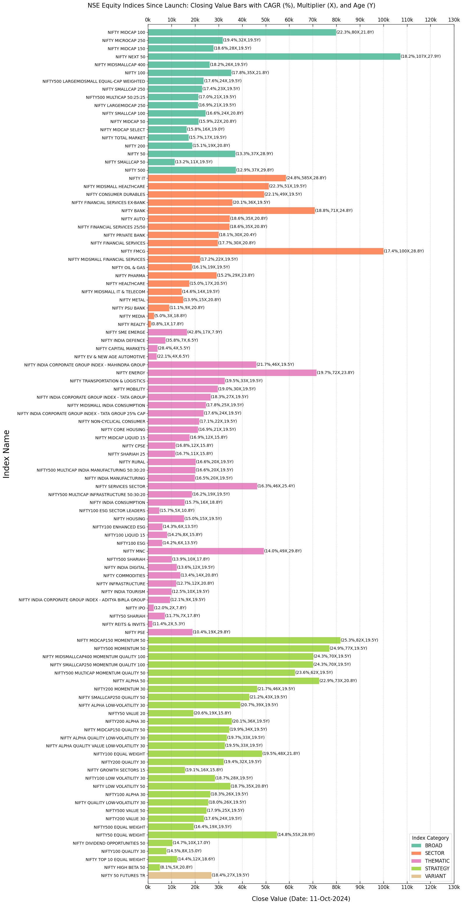

===============
Visualization
===============

A brief overview of several features related to data visualization.

Class Instance
----------------
Let's start by instantiating the class.

.. code-block:: python

    import BharatFinTrack
    visual = BharatFinTrack.Visual()

Equity Index Closing Values
-----------------------------

In this section, we plot a bar graph of equity index closing values, sorted in descending order of CAGR (%) by category. 
To obtain the required data, use the Excel files generated from the :ref:`Equity Index Price CAGR <fucn_equity_index_price_cagr>` 
and :ref:`Equity TRI CAGR <fucn_equity_tri_cagr>` sections. The following code produces a plot of the closing TRI values. 
You can also experiment with index prices to observe differences in the results.

.. code-block:: python
    
    excel_file = r"C:\Users\Username\Folder\tri_closing_value.xlsx"
    
    # plot descending sort of TRI CAGR by category since launch
    visual.plot_category_sort_index_cagr_from_launch(
        excel_file=r"C:\Users\Username\Folder\sort_tri_cagr_by_category.xlsx"
        figure_file=r"C:\Users\Username\Folder\plot_tri.png"
    )
    
    
The output plot looks similar to the following figure subject to the change of closing values which chanage in each trading day.
    

    

    
    
