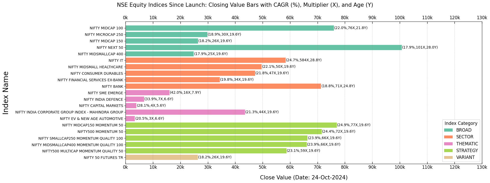
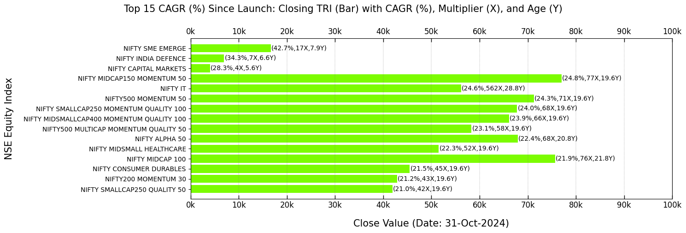
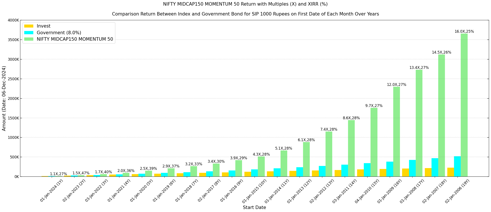
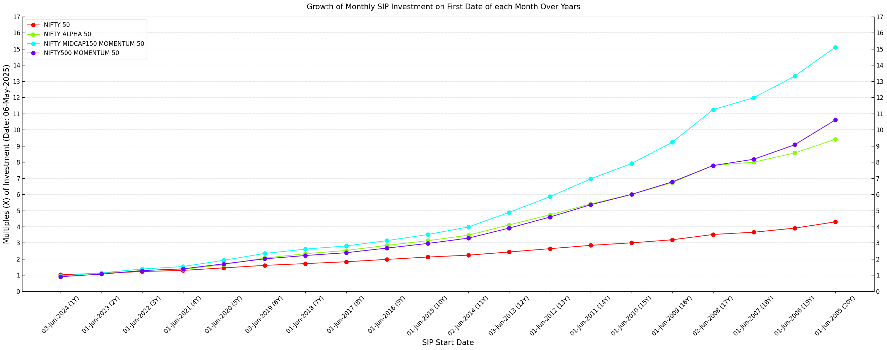

===============
Visualization
===============

A brief overview of several features related to data visualization.

Class Instance
----------------
Let's start by instantiating the class.

.. code-block:: python

    import BharatFinTrack
    visual = BharatFinTrack.Visual()

Equity Index Closing Values
-----------------------------

This section provides bar plots of NSE equity indices’ closing values, focusing on `Price` and `TRI` performance metrics sorted by CAGR (%). The data for these visualizations must be sourced from the Excel files generated in the :ref:`Equity Index Price CAGR <f_equity_index_price_cagr>` 
and :ref:`Equity TRI CAGR <f_equity_tri_cagr>` sections.

The following code plots the top five NSE equity indices by `TRI` CAGR (%) within each category since launch.

.. code-block:: python
    
    visual.plot_top_cagr_indices_by_category(
        excel_file=r"C:\Users\Username\Folder\tri_sort_cagr_by_category.xlsx",
        close_type='TRI',
        figure_file=r"C:\Users\Username\Folder\plot_tri_top_cagr_by_category.png",
        top_cagr=5
    )

The output plot will resemble the following figure, but keep in mind that the closing values change with each trading day.

A bar plot of the top 15 NSE equity indices by overall `TRI` CAGR (%) is generated.

.. code-block:: python
    
    visual.plot_top_cagr_indices(
        excel_file=r"C:\Users\Username\Folder\tri_sort_cagr.xlsx",
        close_type='TRI',
        figure_file=r"C:\Users\Username\Folder\tri_top_cagr.png",
        top_cagr=15
    )
    
The resulting plot will resemble the example shown below.

   
   
SIP Comparison with Government Securities
-------------------------------------------
A bar plot displays the comparison of investments and returns over the years for the `TRI` data of the `NIFTY MIDCAP150 MOMENTUM 50` index and government bond with an assumed coupon rate. Data required to compute the SIP must be sourced from the Excel file generated in the :ref:`Total Return Index (TRI) <f_download_tri>` section. 

.. code-block:: python
    
    visual.plot_sip_index_vs_gsec(
        index='NIFTY MIDCAP150 MOMENTUM 50'
        excel_file=r"C:\Users\Username\Folder\index_data.xlsx",
        figure_file=r"C:\Users\Username\Folder\SIP_gsec_vs_index.png",
        gsec_return=8
    )

    
The resulting plot will look similar to the example below.

   
   
SIP Comparison Across Indices
-------------------------------

A plot comparing the year-wise growth multiples (X) of a monthly SIP investment across `TRI` indices, including the popular `NIFTY 50` and other top-performing NSE equity indices over the years. The data required for SIP calculations must be sourced from the Excel files generated in the :ref:`Total Return Index (TRI) <f_download_tri>` section. Ensure that all Excel files are stored in the designated input folder, with each file named as `{index}.xlsx` to correspond to the index names provided in the list of indices.

.. code-block:: python

    index_list = [
        'NIFTY 50',
        'NIFTY ALPHA 50',
        'NIFTY MIDCAP150 MOMENTUM 50',
        'NIFTY500 MOMENTUM 50',
    ]
    
    visual.plot_sip_growth_comparison_across_indices(
        indices=index_list
        folder_path=r"C:\Users\Username\Folder",
        figure_file=r"C:\Users\Username\Folder\sip_growth_multiple.png"
    )
    
    
The produced plot will be comparable to the example depicted below.

    

    
    
