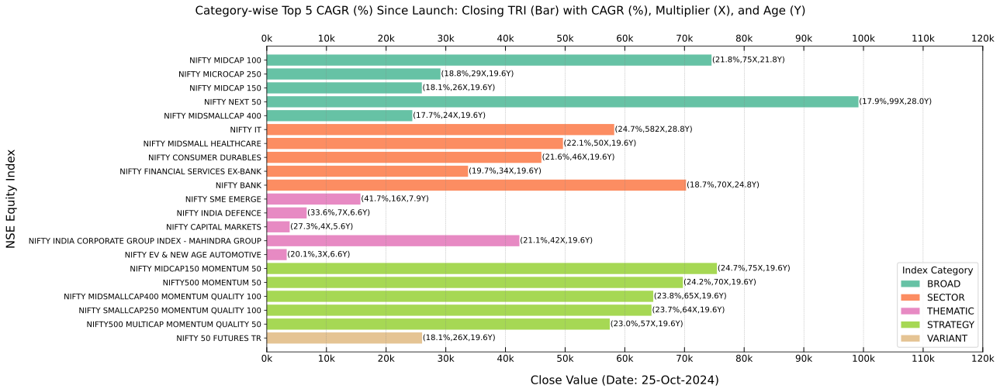
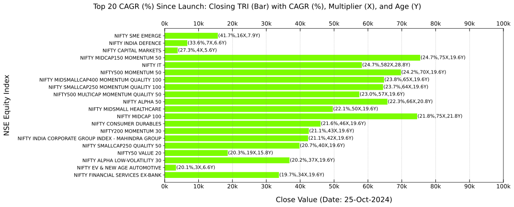

===============
Visualization
===============

A brief overview of several features related to data visualization.

Class Instance
----------------
Let's start by instantiating the class.

.. code-block:: python

    import BharatFinTrack
    visual = BharatFinTrack.Visual()

Equity Index Closing Values
-----------------------------

This section provides bar plots of NSE equity indices’ closing values, focusing on `Price` and `TRI` performance metrics sorted by CAGR (%). The data for these visualizations can be sourced from the Excel files generated in the :ref:`Equity Index Price CAGR <fucn_equity_index_price_cagr>` 
and :ref:`Equity TRI CAGR <fucn_equity_tri_cagr>` sections. 

The code below plots a bar graph, sorted in descending order by CAGR (≥ 15%) since inception and grouped by index category. Users can substitute `TRI` with `Price` to explore variations.

.. code-block:: python
    
    visual.plot_cagr_filtered_indices_by_category(
        excel_file=r"C:\Users\Username\Folder\tri_sort_cagr_by_category.xlsx",
        figure_file=r"C:\Users\Username\Folder\plot_tri_sort_cagr_filtered_by_category.png",
        threshold_cagr=15
    )

The following code generates a bar plot for the top five NSE equity indices by `TRI` CAGR (%) within each category since launch.

.. code-block:: python
    
    visual.plot_top_cagr_indices_by_category(
        excel_file=r"C:\Users\Username\Folder\tri_sort_cagr_by_category.xlsx",
        figure_file=r"C:\Users\Username\Folder\plot_tri_top_cagr_by_category.png",
        top_cagr=5
    )
    
    
The output plot will resemble the following figure, but keep in mind that the closing values change with each trading day.

This code generates a bar plot of the top twenty NSE equity indices by overall `TRI` CAGR (%).

.. code-block:: python
    
    visual.plot_top_cagr_indices(
        excel_file=r"C:\Users\Username\Folder\tri_sort_cagr.xlsx",
        figure_file=r"C:\Users\Username\Folder\tri_top_cagr.png",
        top_cagr=20
    )
    
The resulting plot will resemble the example shown below.

    

    
    
