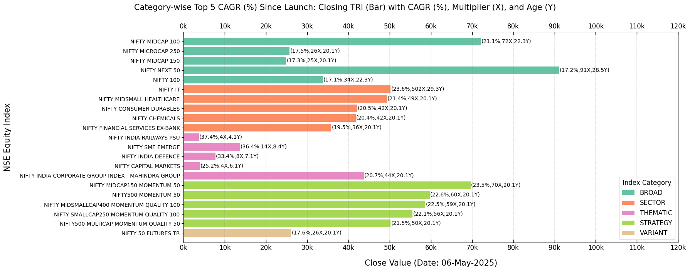

===============
Visualization
===============

A brief overview of several features related to data visualization.

Class Instance
----------------
Let's start by instantiating the class.

.. code-block:: python

    import BharatFinTrack
    visual = BharatFinTrack.Visual()

Equity Index Closing Values
-----------------------------

We plot a bar graph of the closing values of `Price` for NSE equity indices, sorted in descending order of CAGR (%) since launch by category.
To obtain the necessary data, use the Excel files generated from the :ref:`Equity Index Price CAGR <fucn_equity_index_price_cagr>` 
and :ref:`Equity TRI CAGR <fucn_equity_tri_cagr>` sections. The following code produces a plot of the closing TRI values. 
You can also experiment with index prices to observe differences in the results.

.. code-block:: python
    
    # bar plot of NSE indices, closing values sorted by TRI CAGR (≥ 15%) since inception, by category
    visual.plot_cagr_filtered_indices_by_category(
        excel_file=r"C:\Users\Username\Folder\tri_sort_cagr_by_category.xlsx",
        figure_file=r"C:\Users\Username\Folder\plot_tri_sort_cagr_by_category.png",
        threshold_cagr=15
    )

The following code generates a bar plot of closing values for NSE equity indices `TRI` with the top five CAGR (%) since launch in each category.

.. code-block:: python
    
    visual.plot_top_cagr_indices_by_category(
        excel_file=r"C:\Users\dpal22\Desktop\code_data\d_finance\nifty_indices_cagr_from_inception\tri_sort_cagr_by_category.xlsx",
        figure_file=r"C:\Users\dpal22\Desktop\code_data\d_finance\nifty_indices_cagr_from_inception\tri_top_cagr_by_category.png",
        top_cagr=5
    )
    
    
The output plot will resemble the following figure, but keep in mind that the closing values change with each trading day.
    

    

    
    
