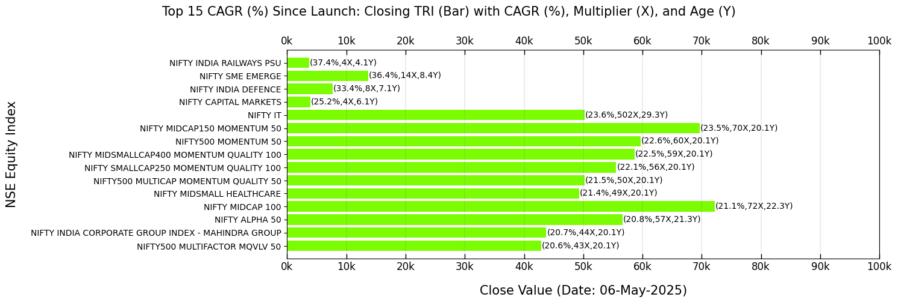

===============
Visualization
===============

A brief overview of several features related to data visualization.

Class Instance
----------------
Let's start by instantiating the class.

.. code-block:: python

    import BharatFinTrack
    visual = BharatFinTrack.Visual()

Equity Index Closing Values
-----------------------------

This section provides bar plots of NSE equity indices’ closing values, focusing on `Price` and `TRI` performance metrics sorted by CAGR (%). The data for these visualizations must be sourced from the Excel files generated in the :ref:`Equity Index Price CAGR <f_equity_index_price_cagr>` 
and :ref:`Equity TRI CAGR <f_equity_tri_cagr>` sections. 

A bar graph is generated, sorted in descending order by CAGR (≥ 15%) since inception and grouped by index category. Users can substitute `TRI` with `Price` to explore variations.

.. code-block:: python
    
    visual.plot_cagr_filtered_indices_by_category(
        excel_file=r"C:\Users\Username\Folder\tri_sort_cagr_by_category.xlsx",
        figure_file=r"C:\Users\Username\Folder\plot_tri_sort_cagr_filtered_by_category.png",
        threshold_cagr=15
    )

The next plot highlights the top five NSE equity indices by `TRI` CAGR (%) within each category since launch.

.. code-block:: python
    
    visual.plot_top_cagr_indices_by_category(
        excel_file=r"C:\Users\Username\Folder\tri_sort_cagr_by_category.xlsx",
        figure_file=r"C:\Users\Username\Folder\plot_tri_top_cagr_by_category.png",
        top_cagr=5
    )

The output plot will resemble the following figure, but keep in mind that the closing values change with each trading day.

.. image:: _static/tri_top_cagr_by_category.png
   :align: left

A bar plot of the top 15 NSE equity indices by overall `TRI` CAGR (%) is generated.

.. code-block:: python
    
    visual.plot_top_cagr_indices(
        excel_file=r"C:\Users\Username\Folder\tri_sort_cagr.xlsx",
        figure_file=r"C:\Users\Username\Folder\tri_top_cagr.png",
        top_cagr=20
    )
    
The resulting plot will resemble the example shown below.

SIP Return
-------------
A bar plot displays investments and returns over the years for `TRI` data of the `NIFTY MIDCAP150 MOMENTUM 50` index. Data required to compute the SIP must be sourced from the Excel file generated in the :ref:`Total Return Index (TRI) <f_download_tri>` section. 

.. code-block:: python
    
    visual.plot_yearwise_sip_returns(
        index='NIFTY MIDCAP150 MOMENTUM 50'
        excel_file=r"C:\Users\Username\Folder\NIFTY MIDCAP150 MOMENTUM 50.xlsx",
        figure_file=r"C:\Users\Username\Folder\SIP_Yearwise_NIFTY_50.png"
    )
    
    
The resulting plot will look similar to the example below.

.. image:: _static/sip_yearwise_NIFTY_MIDCAP150_MOMENTUM_50.png
   :align: left
   
   
SIP Comparison
-----------------

A line plot comparing monthly SIP investment growth across multiple NSE equity `TRI` indices over the years. Data required to compute the SIP must be sourced from the Excel file generated in the :ref:`Total Return Index (TRI) <f_download_tri>` section. All Excel files must be stored in a folder and each Excel file must be named as ‘{index}.xlsx’ corresponding to the index names provided in the indices list.  

.. code-block:: python

    index_list = [
        'NIFTY 50',
        'NIFTY ALPHA 50',
        'NIFTY MIDCAP150 MOMENTUM 50',
        'NIFTY MIDSMALLCAP400 MOMENTUM QUALITY 100',
        'NIFTY SMALLCAP250 MOMENTUM QUALITY 100',
        'NIFTY500 MOMENTUM 50'
    ]
    
    visual.plot_sip_growth_comparison_across_indices(
        indices=index_list
        folder_path=r"C:\Users\Username\Folder",
        figure_file=r"C:\Users\Username\Folder\sip_invest_growth_across_indices.png"
    )
    
    
The produced plot will be comparable to the example depicted below.

.. image:: _static/sip_invest_growth_across_indices.png
   :align: left

    

    
    
